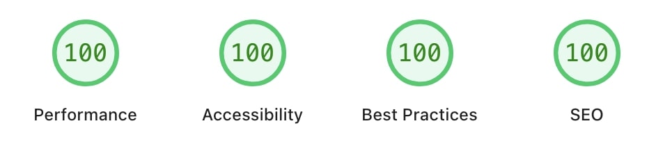

# High-Performance Trading Platform (HPTP)

> **Note: Demonstration Project**
> This project is a demonstration developed as part of a professional portfolio to showcase my technical expertise in full-stack development (JavaScript/Python) and DevOps (AWS CI/CD) in the design of high-performance trading systems. It is intended for illustrative purposes and may not represent a production-ready solution.

This project is a high-performance trading platform, featuring a Vue.js frontend and a FastAPI backend, designed for backtesting trading strategies and running Monte Carlo simulations. The infrastructure is defined using Terraform for deployment on AWS.

## Table of Contents
- [Project Overview](#project-overview)
- [Frontend Performance](#frontend-performance)
- [Architecture](#architecture)
  - [Local Development Architecture](#local-development-architecture)
  - [Cloud Architecture (AWS Terraform)](#cloud-architecture-aws-terraform)
- [Local Development Setup](#local-development-setup)
  - [Prerequisites](#prerequisites)
  - [Backend Setup](#backend-setup)
  - [Frontend Setup](#frontend-setup)
- [Deployment](#deployment)
- [Future Enhancements](#future-enhancements)

## Project Overview

The platform provides:
- **Frontend (Vue.js)**: A user interface for configuring and running backtests and Monte Carlo simulations, visualizing results, and managing data.
- **Backend (FastAPI)**: A Python API that handles business logic, data processing, backtesting algorithms, Monte Carlo simulations, and interacts with a PostgreSQL database and Redis cache.
- **Data Management**: Supports uploading custom CSV datasets and utilizing pre-loaded datasets for simulations.
- **Infrastructure as Code (Terraform)**: Defines the AWS cloud infrastructure for deploying the application.

## Frontend Performance



- **Asset Optimization**: Advanced Vite configuration with Terser compression, tree-shaking, and code splitting
- **Compression**: Gzip/Brotli compression with optimized bundle sizes
- **Caching Strategy**: CloudFront CDN with long-term caching (1 year TTL) for static assets
- **Image Optimization**: SVG icons, optimized image formats, and lazy loading
- **SEO Enhancement**: Multilingual meta descriptions, Open Graph tags, Twitter Cards
- **Accessibility**: Semantic HTML, proper ARIA labels, keyboard navigation support
- **Responsive Design**: Mobile-first approach with optimized viewport configuration

## Architecture

### Local Development Architecture

For local development, the project leverages `docker-compose` to orchestrate the services:

- **Frontend**: Served by Vite, accessible via `http://localhost:80`.
- **Backend**: A FastAPI application running on `http://localhost:8000`.
- **PostgreSQL**: A PostgreSQL 16 database instance for data persistence.
- **Redis**: A Redis 7 instance for caching.

All services communicate over a shared Docker network.

### Cloud Architecture (AWS Terraform)

The cloud infrastructure is provisioned on AWS using Terraform, designed with cost-effectiveness in mind for demo and low-traffic projects.

- **Single VPC**: All resources are contained within a single Virtual Private Cloud (VPC) in a single AWS region.
- **ECS Cluster**: An Amazon Elastic Container Service (ECS) cluster running Fargate launch type.
- **Backend Task Definition**: A single ECS task definition hosts multiple containers:
    - **Backend (FastAPI)**: The main application logic.
    - **PostgreSQL**: The database runs as a container within the same ECS task, utilizing Amazon Elastic File System (EFS) for persistent storage of database data. This choice reduces costs compared to a managed service like Amazon RDS.
    - **Redis**: The caching layer also runs as a container within the same ECS task, further optimizing costs by avoiding a dedicated Amazon ElastiCache instance.
- **Application Load Balancer (ALB)**: Distributes incoming traffic to the backend service.
- **S3 Buckets**:
    - A private S3 bucket for hosting the frontend static assets, integrated with CloudFront.
    - A dedicated S3 bucket for storing Monte Carlo simulation artifacts.
- **CloudFront**: A Content Delivery Network (CDN) for serving the frontend, improving performance and security.
- **Route 53**: Manages DNS records for the application.
- **ECR**: Amazon Elastic Container Registry for storing Docker images of the backend.
- **IAM**: Manages roles and policies for secure access.
- **CloudWatch**: For logging and monitoring.
- **Monte Carlo Worker System**: Asynchronous job processing with concurrent execution capabilities:
  - **In-process Worker**: `SimpleMonteCarloWorker` supporting up to 2 simultaneous jobs with ThreadPoolExecutor
  - **Concurrent Processing**: Multi-threaded execution for parallel Monte Carlo simulations
- **Cognito**: For user authentication and authorization.

**Note on Cost-Saving Choices**:
The decision to run PostgreSQL and Redis within the same ECS Fargate task as the backend, and to use a single VPC/region, was made to minimize infrastructure costs for development and demonstration purposes. For a production-grade setup with higher traffic and availability requirements, it is recommended to migrate to managed services like Amazon RDS for PostgreSQL and Amazon ElastiCache for Redis.

## Local Development Setup

To get the project up and running on your local machine, follow these steps:

### Prerequisites

Ensure you have the following installed:

-   **Docker** and **Docker Compose**: For running the services in containers.
-   **Poetry**: For Python dependency management (backend).
-   **pnpm**: For JavaScript dependency management (frontend).
-   **Python 3.13+**: For the backend.
-   **Node.js (LTS)**: For the frontend.

### Backend Setup

1.  **Navigate to the backend directory**:
    ```bash
    cd backend/api
    ```

2.  **Install Python dependencies**:
    ```bash
    poetry install
    ```

3.  **Set up environment variables**:
    Copy the example environment file and fill in the necessary values.
    ```bash
    cp .env.example .env
    # Edit .env with your specific configurations
    ```

4.  **Run the bootstrap script**:
    This script typically handles database migrations and initial data setup.
    ```bash
    poetry run python scripts/bootstrap.py
    ```

### Frontend Setup

1.  **Navigate to the frontend directory**:
    ```bash
    cd web
    ```

2.  **Install JavaScript dependencies**:
    ```bash
    pnpm install
    ```

3.  **Set up environment variables**:
    Copy the example environment file and fill in the necessary values.
    ```bash
    cp .env.example .env
    # Edit .env, ensuring VITE_API_BASE_URL points to your backend (e.g., /api/v1 or http://localhost:8000/api/v1)
    ```

4.  **Start the frontend development server**:
    ```bash
    pnpm dev
    ```
    The frontend will be accessible at `http://localhost:5173` (or another port if configured).

### Docker Compose Setup (Alternative)

For a quick local setup using Docker Compose, follow these steps:

1.  **Ensure .env files are configured**:
    Make sure you have `.env` files in both the `web/` and `backend/api/` directories, configured based on their respective `.env.example` files.

2.  **Navigate to the project root directory**:
    ```bash
    cd /Users/juliettecattin/WebstormProjects/high-performance-trading-platform
    ```

3.  **Build and run the services**:
    ```bash
    docker-compose up --build
    ```

**Note on Docker Compose Usage**: While Docker Compose provides a convenient way to run all services locally, this setup has not been rigorously tested or maintained recently. You may encounter issues, and the primary recommended local development approach involves running backend and frontend services separately as detailed above.

## Deployment

The project's cloud infrastructure is defined using Terraform. To deploy the application to AWS:

1.  **Navigate to the Terraform directory**:
    ```bash
    cd terraform
    ```

2.  **Initialize Terraform**:
    ```bash
    terraform init
    ```

3.  **Review the plan**:
    ```bash
    terraform plan -var-file="terraform.tfvars"
    ```
    (You will need to create a `terraform.tfvars` file based on `terraform.tfvars.example`.)

4.  **Apply the changes**:
    ```bash
    terraform apply -var-file="terraform.tfvars"
    ```

This will provision all the necessary AWS resources and deploy the application.

## Future Enhancements

The following features and improvements are planned for future releases to enhance scalability, performance, and user experience:

### Infrastructure & Scalability
- **Distributed Queue System**: Implement AWS SQS for job distribution across multiple worker instances
- **Redis Cache Layer**: Add Redis for caching frequently accessed data, session management, and real-time features
- **Horizontal Worker Scaling**: Auto-scaling worker instances based on queue depth and system load
- **Database Optimization**: Migrate to Amazon RDS with read replicas for improved performance and reliability

### Real-time Features
- **Enhanced WebSocket Support**: Real-time portfolio updates, live market data streaming, and collaborative features
- **Push Notifications**: Browser and mobile notifications for job completion, alerts, and market events

### Security & Compliance
- **Multi-Factor Authentication**: Enhanced security with TOTP, SMS, and biometric authentication

### Performance Optimizations
- **Microservices Architecture**: Service decomposition for better scalability and maintainability
- **API Rate Limiting**: Advanced throttling and quota management for API endpoints
